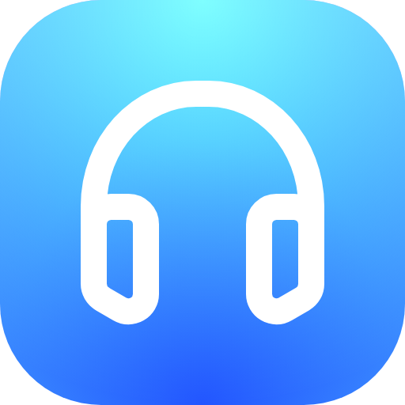
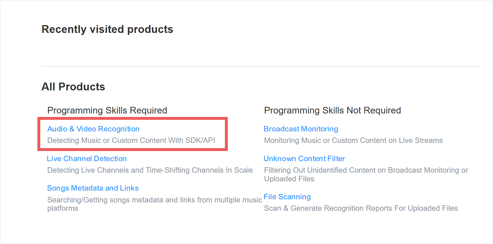
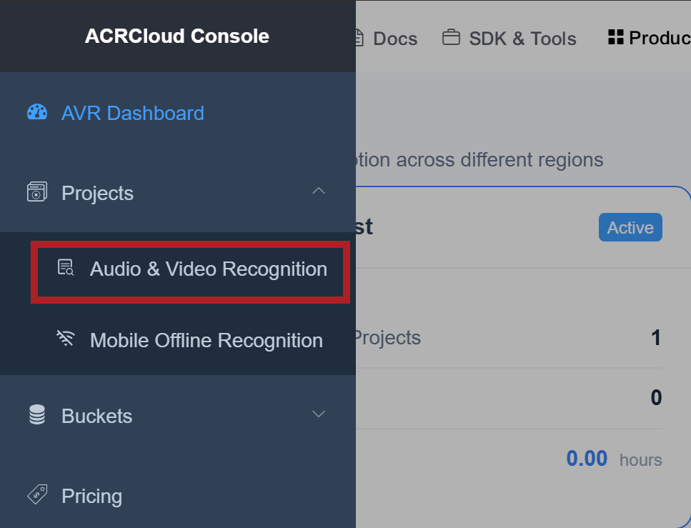
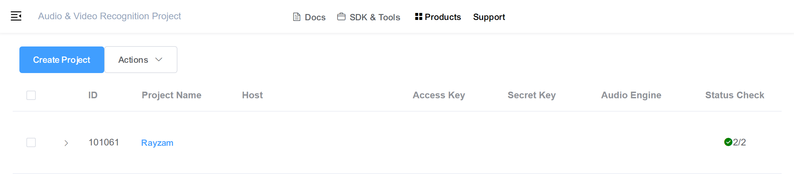
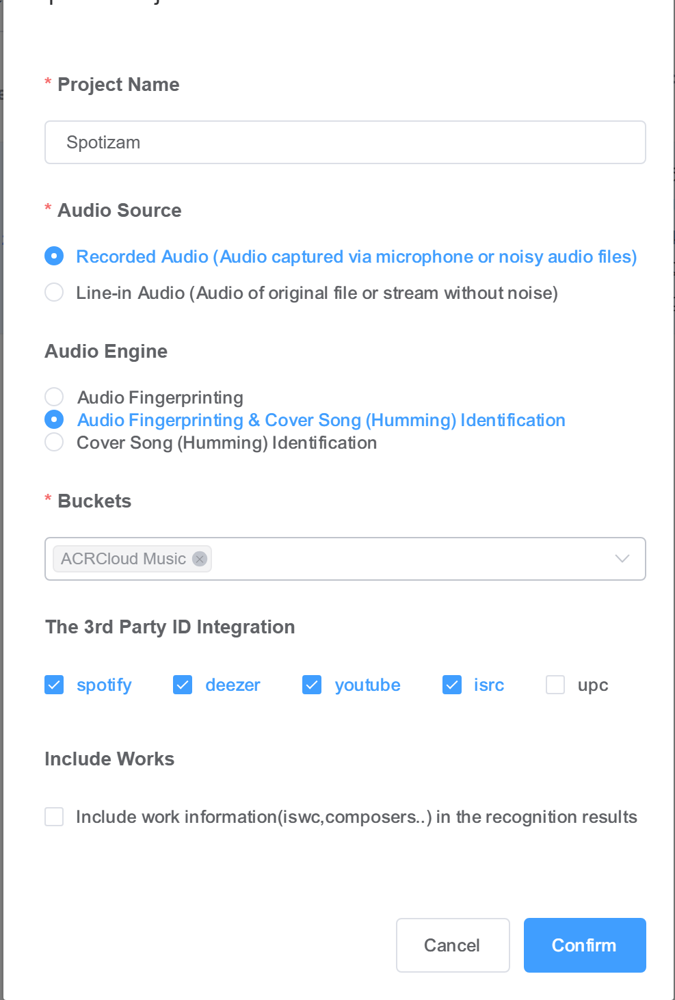

    

# Rayzam

Rayzam is a Raycast music recognition extension inspired by the quick “what song is this?” flow people know from Shazam.

Rayzam as in Raycast + Shazam, do you get it? 😁

Identify songs from Raycast, save the result to local history, and jump straight to Spotify, Apple Music, YouTube Music, or YouTube.

## Requirements

- Raycast
- `ffmpeg` available on your PATH
- ACRCloud credentials if you use ACRCloud
- AudD API token if you want to switch to AudD
- Microphone permission for Raycast

## Pricing Note

Rayzam does not include a shared recognition account. You bring your own provider credentials.

ACRCloud usually starts with a 14-day trial. After the trial, ACRCloud is pay-as-you-go; check the pricing page in your ACRCloud Console while logged in for the exact rate for your project. The final price can change based on options such as the `ACRCloud Music` bucket and third-party ID integrations like Spotify or YouTube.

AudD usually starts with a 14-day trial where you have 300 free requests and has its own pricing after the trial and account limits. Check your AudD dashboard for the current terms on your account.

## Setup

1. Install dependencies with `npm install`.
2. Run `npm run dev` during development, or install the extension in Raycast.
3. Open Raycast preferences, choose Rayzam, and fill in credentials for the provider you want to use.
4. Set a recording duration. `15` seconds is a good starting point.

## ACRCloud Setup

Rayzam uses your own ACRCloud Audio & Video Recognition project.

1. Create an account at <https://console.acrcloud.com>.
2. Open **Audio & Video Recognition** from Products or the Projects sidebar.

3. Click **Create Project**.

4. Use these project settings:

| Setting                  | Recommended value                                            |
| ------------------------ | ------------------------------------------------------------ |
| Project Name             | `Rayzam` or any name you like                                |
| Audio Source             | `Recorded Audio`                                             |
| Audio Engine             | `Audio Fingerprinting & Cover Song (Humming) Identification` |
| Buckets                  | `ACRCloud Music`                                             |
| 3rd Party ID Integration | Enable `spotify`, `deezer`, `youtube`, and `isrc`            |

5. Copy `Host`, `Access Key`, and `Secret Key` from the same project.
6. Paste all three values into Raycast Preferences -> Extensions -> Rayzam.

If credentials are mixed between projects or regions, ACRCloud can reject requests with `invalid signature`.

### Recommended ACRCloud Integrations

Rayzam works best when these ACRCloud third-party integrations are enabled:

- `spotify`: gives Rayzam a direct Spotify track ID.
- `deezer`: gives Rayzam a Deezer album ID, which can be used to fetch album artwork without the separate ACRCloud Metadata API.
- `youtube`: gives Rayzam a YouTube video ID and a last-resort thumbnail fallback.
- `isrc`: gives Rayzam a stable recording code that can help future metadata lookups.

If you only enable Spotify and YouTube, recognition still works, but album artwork may be missing unless ACRCloud returns it directly or you configure the optional Metadata API token.

### Optional ACRCloud Artwork

ACRCloud recognition responses often include only IDs for Spotify, YouTube, or Deezer. Album artwork usually comes from ACRCloud's separate Metadata API.

To enable richer artwork for ACRCloud matches:

1. In ACRCloud Console, open **Developer Settings**.
2. Create an API token.
3. Paste it into **ACRCloud Metadata API Token** in Raycast Preferences -> Extensions -> Rayzam.

Leave **ACRCloud Metadata API Host** empty unless your account uses a different metadata API host.

## AudD Setup

1. Create or sign in to an AudD account at <https://audd.io>.
2. Copy your API token from the AudD dashboard.
3. Paste it into **AudD API Key** in Raycast Preferences -> Extensions -> Rayzam.

AudD is useful for original song playback. For singing and humming, use ACRCloud.

Rayzam asks AudD for `apple_music,spotify,deezer` metadata. In practice:

- `apple_music` usually gives a direct Apple Music URL and high-quality artwork.
- `spotify` usually gives a direct Spotify track ID and album images.
- `deezer` can be used as an extra artwork fallback when available.

You only need to configure the provider you plan to use. If you start recording with a selected provider that has missing credentials, Rayzam will notify you of it.

## Commands

### Identify Song

Records a short audio sample, sends it to the selected recognition provider, then shows the best match with quick actions. ACRCloud is recommended for singing and humming; AudD is best for original playback.

### Song History

Shows previous matches stored locally in Raycast, with actions for Spotify, Apple Music, YouTube Music, YouTube, copy, export, and delete.

## Save Audio on device

This is optional. Enable **Save audio recordings** in Rayzam preferences and choose a folder with the directory picker. If the selected folder is unavailable, Rayzam saves the audio in its Raycast support folder.

## Save full response from recognition service

This is optional. Enable **Save recognition JSON responses** in Rayzam preferences and choose a folder with the directory picker.
If the selected folder is unavailable, Rayzam saves the audio in its Raycast support folder.

## Privacy

Rayzam stores history locally in Raycast. Recorded audio is only sent to the recognition provider you configure and a copy will be saved to your device if you enable audio saving.

## Troubleshooting

- No match: try a clearer source, raise the duration to at least `15` seconds, or use ACRCloud.
- Missing microphone: check OS microphone permissions and the Rayzam input device preference.
- ACRCloud error: confirm `Host`, `Access Key`, and `Secret Key` all come from the same project.
- Enable the **Save recognition JSON responses** option in the preferences and check the files to see the response being returned by the recognition service
